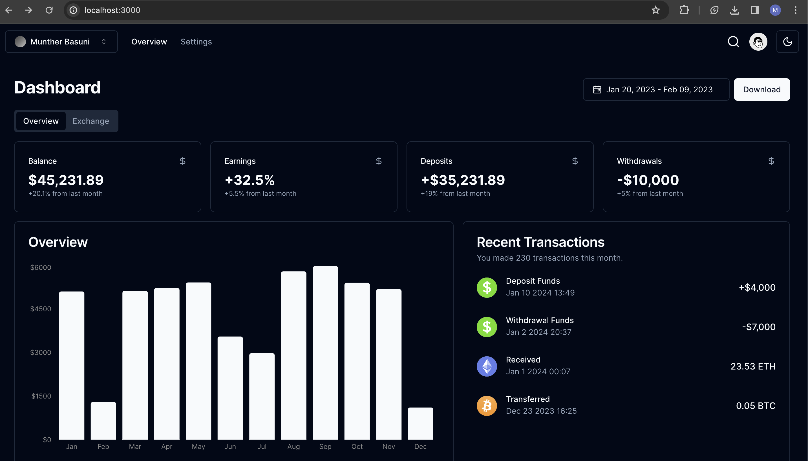

# stablecoin-transaction-portal

## Getting Started

First, run the development server:

```bash
npm run dev
```
or
```
pnpm run dev
```

Open [http://localhost:3000](http://localhost:3000) with your browser to see the result.

## Overview

Data is fetched from a json file in src folder "data.json"

A mock login API returns a token to be sent in authorization header when accessing private APIs

NextJs caches fetch requests by default, so we can call the auth function to get the token before each request.

Otherwise, we can store the user data (preferably encrypted) in cookies/local storage, or use context API.

Frontend components are constructed mostly in a compound pattern which allows for the composition of components with a clear interface and facilitates the customization of behavior and appearance as per needed

Used Zod library for validation on backend, also, re-used the Zod schema to validate the form before submission.

Used React Hook Form library, which uses isolated uncontrolled components, giving you the ability to easily build an accessible custom form

Transfer Form can be found in the "Exchange" Tab



